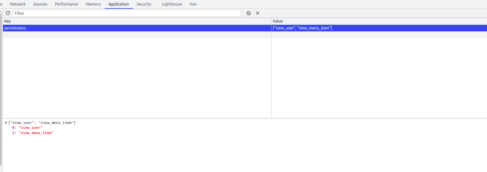

# vue-locked-door
A simple VueJs package that manages permissions!

# Install via npm
https://www.npmjs.com/package/vue-locked-door

`npm i vue-locked-door`

## Usage

```
import HasPermission from 'vue-locked-door/src/HasPermission';
```

```
<HasPermission :all-permissions="['view_user', 'edit_user']" :permissions-to-be-checked="['view_user']" :permissions-in-storage="true" :permissions-in-storage-key="'keyOfPermissions'">
  <div>hello</div> 
</HasPermission>
```

## Props

`1. all-permissions -> are all the permissions that a user has for example when he is logged in | this property is not required.`

`2. :permissions-to-be-checked -> are the permissions to be checked, for example you want to display a user a menu item where it has permissions to see it | this property is required.`

`3. :permissions-in-storage="true" -> if this is enabled it will by default search on the storage of the local machine for the permissions | this property is not required`

`4. :permissions-in-storage-key="true" -> if the permissions-in-storage is set to true, the package will search for the key given in this property in the local storage, 
and if in the local storage this key has an array with permissions the package will make a check of the actual permissions with these permissions in the local storage
| this propery is not required`




